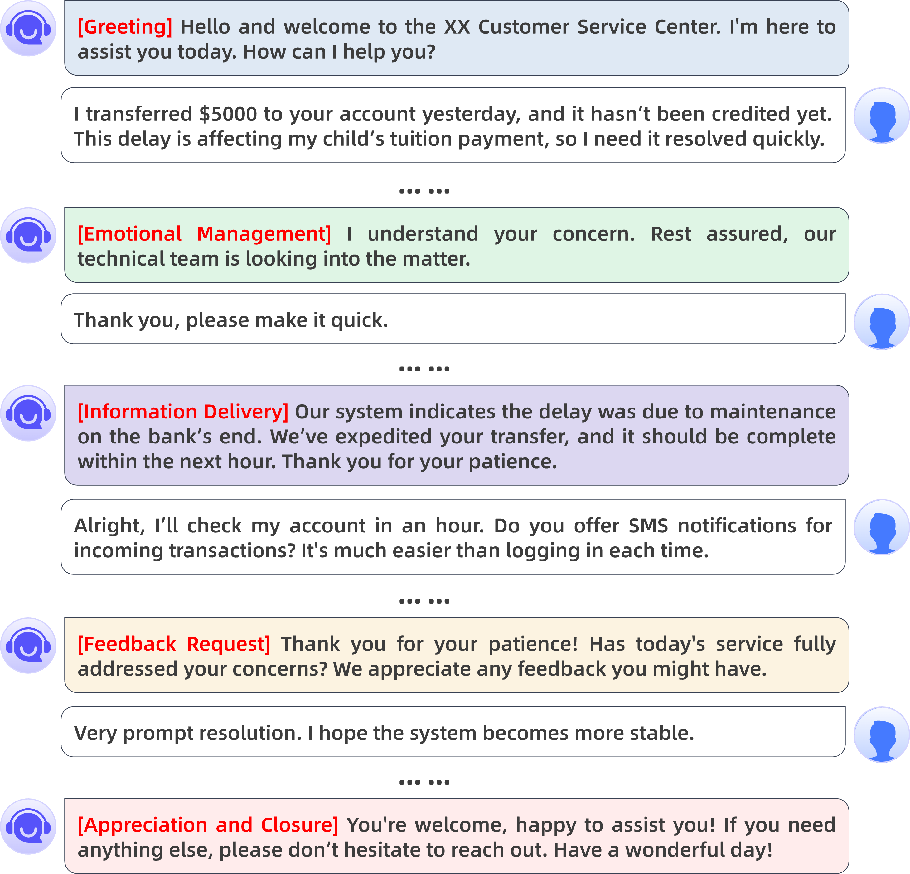
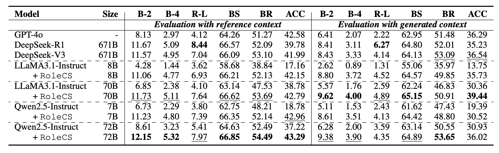

<div align="center">
    <h1><b>评估、增强与改善客户支持对话</b></h1>


[](https://arxiv.org/abs/2508.04423)
[](https://github.com/aliyun/qwen-dianjin)
[](https://huggingface.co/DianJin)
[](https://modelscope.cn/organization/tongyi_dianjin)

**中文** | [**EN**](README.md)

</div>

## 目录
- [简介](#summary)
- [数据集下载](#download)
- [性能比较](#performance)
- [许可证](#license)
- [引用](#cite)

## 📢 简介<a name="summary"></a>



有效的客户支持不仅要求精确地解决问题，还需采取结构化且富有同理心的沟通方式，并符合专业标准。然而，现有的对话数据集通常缺乏战略性指导，且真实服务数据难以获取与标注。为应对这些挑战，本文提出了客户支持对话（Customer Support Conversation, CSC）任务，旨在训练客户服务人员利用明确定义的支持策略进行回复。我们基于COPC工作指南，构建了结构化的CSC框架，明确划分了五个对话阶段与十二项对话策略，以引导高质量的交互。在此基础上，我们构建了CSConv评估数据集，其包含1,855组真实客户与服务人员的对话，均通过大语言模型（LLM）重写以展现策略性互动，并据此完成标注。此外，我们提出了一种角色扮演方法，利用LLM驱动的虚拟角色模拟策略丰富的对话，生成与CSC框架一致的训练数据集RoleCS。实验结果显示，在RoleCS上微调强大的LLM模型，能够显著提升其在CSConv上的高质量、策略对齐回复生成能力。进一步的人类评估也证实了模型在问题解决等方面的提升。

## 📥 数据集下载<a name="download"></a>

|        |                        ModelScope                         |               HuggingFace               |
|:------:|:---------------------------------------------------------:|:---------------------------------------:|
| CSConv | [Data](https://modelscope.cn/organization/tongyi_dianjin) | [Data](https://huggingface.co/DianJin/) |
| RoleCS | [Data](https://modelscope.cn/organization/tongyi_dianjin) | [Data](https://huggingface.co/DianJin/) |

## 📊 性能比较<a name="performance"></a>



## 📋 许可证<a name="license"></a>

本项目遵循 [MIT License](https://lbesson.mit-license.org/).

## 🔖 引用<a name="cite"></a>

如果您使用了我们的数据集，请引用我们的论文。

```
@article{dianjin-csc,
    title   = {Evaluating, Synthesizing, and Enhancing for Customer Support Conversation}, 
    author  = {Jie Zhu, Huaixia Dou, Junhui Li, Lifan Guo, Feng Chen, Chi Zhang, and Fang Kong},
    journal = {arxiv},
    year    = {2025}
}
```
