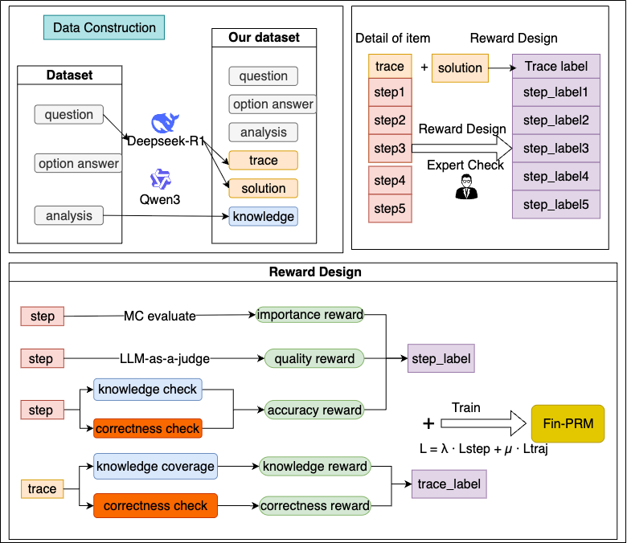
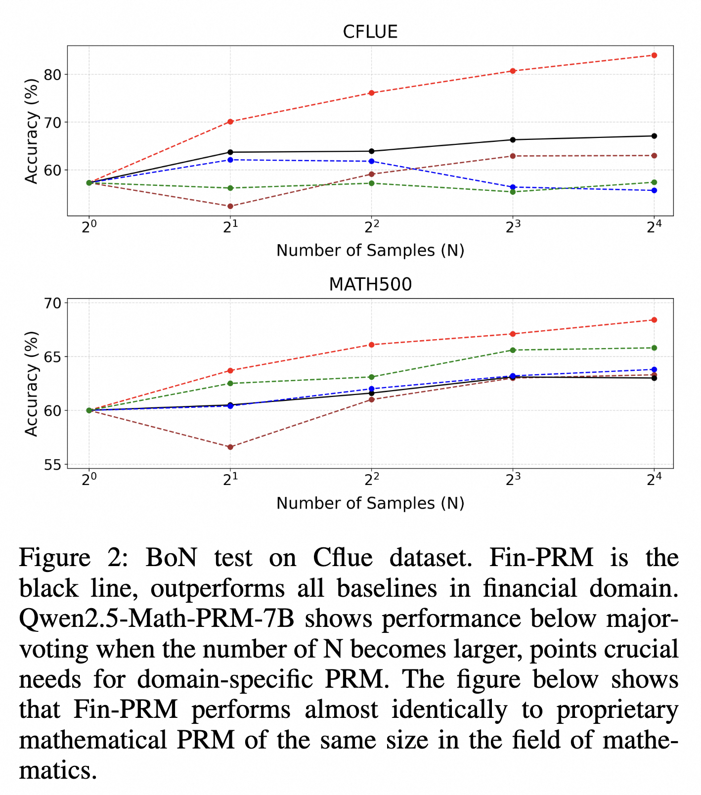
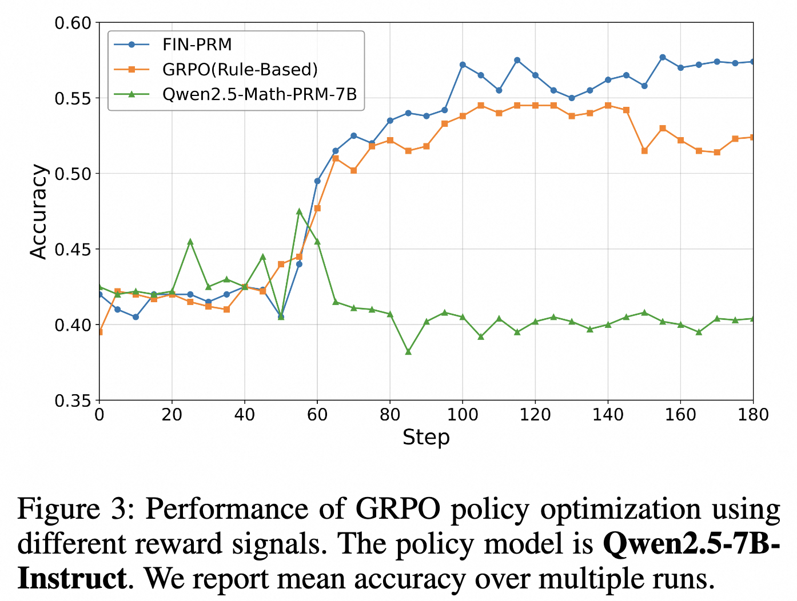
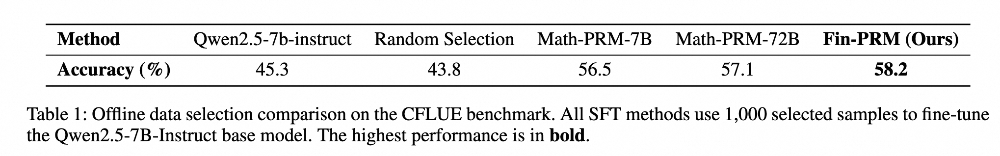

<div align="center">
    <h1><b>DianJin-Fin-PRM</b></h1>
    <p>
    <b>A Process Reward Model for the financial domain</b>
    </p>

[](https://github.com/aliyun/qwen-dianjin)
[](https://huggingface.co/DianJin)
[](https://modelscope.cn/organization/tongyi_dianjin)

[**中文**](README_zh.md) | **EN**

</div>

## Table of Contents
- [Table of Contents](#table-of-contents)
- [📢 Introduction](#-introduction)
- [📥 Model Download](#-model-download)
- [🔧 Reward Design](#-reward-design)
    - [Step-level Reward Modeling](#step-level-reward-modeling)
    - [Trajectory-level Reward Modeling](#trajectory-level-reward-modeling)
- [🚀 Getting Started](#-getting-started)
    - [Envorinment Setup](#envorinment-setup)
    - [Training](#training)
- [🌱  Downstream Application](#--downstream-application)
    - [Setup](#setup)
    - [Training](#training-1)
- [📊 Model Evaluation](#-model-evaluation)
    - [Best-of-N selection](#best-of-n-selection)
    - [Online reward modeling](#online-reward-modeling)
    - [offline data selecion](#offline-data-selecion)
- [📋 License](#-license)
- [🔖 Citation](#-citation)

## 📢 Introduction<a name="summary"></a>

Process Reward Models (PRMs) have emerged as a promising framework for supervising intermediate reasoning in large language models (LLMs), yet existing PRMs are primarily trained on general or Science, Technology, Engineering, and Mathematics (STEM) domains and fall short in domain-specific contexts such as finance, where reasoning is more structured, symbolic, and sensitive to factual and regulatory correctness. We introduce \textbf{Fin-PRM}, a domain-specialized, trajectory-aware PRM tailored to evaluate intermediate reasoning steps in financial tasks. Fin-PRM integrates step-level and trajectory-level reward supervision, enabling fine-grained evaluation of reasoning traces aligned with financial logic. We apply Fin-PRM in both offline and online reward learning settings, supporting three key applications: (i) selecting high-quality reasoning trajectories for distillation-based supervised fine-tuning, (ii) providing dense process-level rewards for reinforcement learning, and (iii) guiding reward-informed Best-of-N inference at test time. Experimental results on financial reasoning benchmarks, including CFLUE and FinQA, demonstrate that Fin-PRM consistently outperforms general-purpose PRMs and strong domain baselines in trajectory selection quality. Downstream models trained with Fin-PRM yield substantial improvements with baselines, with gains of 12.9\% in supervised learning, 5.2\% in reinforcement learning, and 5.1\% in test-time performance. These findings highlight the value of domain-specialized reward modeling for aligning LLMs with expert-level financial reasoning.


## 🔧 Reward Design<a name="reward"></a>

#### Step-level Reward Modeling
To capture the multifaceted nature of a good reasoning step, we decompose our step-level reward into three distinct components: Monte Carlo estimation score $r_{\mathrm{importance}}$ , LLM-as-a-judge score $r_{\mathrm{qual}}$ , and an accuracy score $r_{\mathrm{acc}}$ that verifies its factual correctness.


#### Trajectory-level Reward Modeling
A trajectory consists of correct steps sometimes lead to wrong answer, and PRMs can easily fall into reward hacking. We introduce trajectory-level reward signal combines two parts: an outcome-based correctness score $r_{\mathrm{out}}$ and a knowledge coverage score $r_{\mathrm{cover}}$.

Please refer to [our paper](https://arxiv.org/abs/2508.15202) for more details.




## 🚀 Getting Started<a name="start"></a>

#### Envorinment Setup
We use [TRL](https://github.com/huggingface/trl) framework for SFT training，Please install the following dependencies:
```shell
conda create -n dianjin-prm python==3.12
conda activate dianjin-prm
cd prm_trainer
pip install -r requirements.txt
```

#### Training
```shell
bash train.sh
```

## 🌱  Downstream Application<a name="downstream"></a>
we provide an instruction and examples of how to apply Fin-PRM in downstream applications.

#### Setup
Our implementation of GRPO is largly built on the [verl](https://github.com/volcengine/verl) framework，the installation and environment setup is similar to verl:
```shell
conda create -n downstream python==3.10
conda activate downstream
bash scripts/install_vllm_sglang_mcore.sh
pip install --no-deps -e .
```
#### Training
To generate the training data parquet，run the following command:
```python
python src/grpo_trainer/data_preprocess.py
```
To run GRPO training with Fin-PRM reward on `Qwen2.5-7B-Instruct` policy model, run:
```shell
bash fin_prm_grpo.sh
```

## 📊 Model Evaluation<a name="eval"></a>
#### Best-of-N selection

We evaluate performance in our target financial domain. Using `Qwen2.5-7B-Instruct` as the generator model, we perform BoN selection on a 1,000-sample subset of the CFLUE test set for N values of 4, 8, and 16. Fin-PRM is compared against two baselines: a strong, general-domain Qwen2.5-Math-PRM-7B and major voting method. As presented in Figure \ref{fig:BoN}, in the Cflue BoN test, Fin-PRM consistently leads to greater accuracy gains as N increases, outperforming the majority-voting baseline by more than $5.1\%$ at N=16. This result highlights its effectiveness for financial reasoning.
#### Online reward modeling

Across all evaluations, using Fin-PRM as the reward source consistently yields the best-performing policy. Integrating Fin-PRM boosts performance on CFLUE to 70.5\% and on FinQA to 62.8\%, a significant gain of 3.3 points on both benchmarks compared to the rule-based heuristic. Crucially, Fin-PRM also outperforms the strong Qwen2.5-Math-PRM-7B baseline, highlighting that the domain-specific, factually-grounded process supervision it provides is more effective for guiding RL in a specialized domain than a general-purpose reward model. These results demonstrate that the high-quality learned reward signals from Fin-PRM substantially enhance policy optimization, leading to more capable financial reasoning models.
#### offline data selecion

the selection strategy has a profound impact on model performance. Fine-tuning on randomly selected data degrades performance to 43.8%, highlighting the risk of using noisy synthetic data. In contrast, all PRM-based selection methods provide a substantial boost over the 45.3% base model accuracy. Our domain-specialized Fin-PRM achieves the highest accuracy of 58.2%. This result not only demonstrates a 12.9% improvement over the base model but also confirms that a finance-aware reward model is superior for curating high-quality reasoning data in this domain.

## 📋 License<a name="license"></a>

This project adheres to [MIT License](https://lbesson.mit-license.org/).

## 🔖 Citation<a name="cite"></a>

If you use our model or dataset, please cite our paper.

```
@article{fin-prm,
  title = "Fin-PRM: A Domain-Specialized Process Reward Model for Financial Reasoning in Large Language Models",
  author="Yuanchen Zhou, Shuo Jiang, Jie Zhu, Junhui Li, Lifan Guo, Feng Chen, Chi Zhang",
  journal="arXiv preprint arXiv:2508.15202",
  year="2025"
}
```
