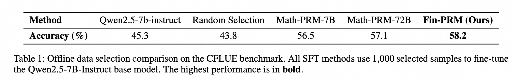

<div align="center">
    <h1><b>DianJin-Fin-PRM</b></h1>
    <p>
    <b>面向金融领域的过程奖励模型</b>
    </p>


[](https://github.com/aliyun/qwen-dianjin)
[](https://huggingface.co/DianJin)
[](https://modelscope.cn/organization/tongyi_dianjin)

**中文** | [**EN**](README.md)

</div>

## 目录
- [目录](#目录)
- [📢 简介](#-简介)
- [📥 模型下载](#-模型下载)
- [🔧 奖励设计](#-奖励设计)
    - [步骤级奖励](#步骤级奖励)
    - [轨迹级别奖励](#轨迹级别奖励)
- [🚀 开始使用](#-开始使用)
    - [环境准备](#环境准备)
    - [训练](#训练)
- [🌱 下游任务应用](#-下游任务应用)
    - [环境准备](#环境准备-1)
    - [训练](#训练-1)
- [📊 模型评测](#-模型评测)
    - [Best-of-N选择](#best-of-n选择)
    - [在线奖励学习](#在线奖励学习)
    - [离线数据筛选](#离线数据筛选)
- [📋 许可证](#-许可证)
- [🔖 引用](#-引用)


## 📢 简介<a name="summary"></a>

过程奖励模型 (PRM) 已成为监督大型语言模型 (LLM) 中级推理的有前景的框架，但现有的 PRM 主要在通用领域或科学、技术、工程和数学 (STEM) 领域进行训练，在金融等特定领域环境下表现不佳。金融领域的推理更具结构化、符号化，且对事实和监管的正确性更为敏感。我们推出了 **Fin-PRM**，这是一个领域专用、轨迹感知的 PRM，旨在评估金融任务中的中间推理步骤。Fin-PRM 集成了步骤级和轨迹级的奖励监督，能够对符合金融逻辑的推理轨迹进行细粒度评估。我们将 Fin-PRM 应用于离线和在线奖励学习环境，支持三大关键应用：(i) 为基于蒸馏的监督微调选择高质量的推理轨迹；(ii) 为强化学习提供密集的流程级奖励；以及 (iii) 在测试时指导基于奖励的 Best-of-N 推理。在包括 CFLUE 和 FinQA 在内的金融推理基准测试上的实验结果表明，Fin-PRM 在轨迹选择质量方面始终优于通用 PRM 和强领域基线。使用 Fin-PRM 训练的下游模型与基线相比取得了显著提升，监督学习性能提升 12.9%，强化学习性能提升 5.2%，测试性能提升 5.1%。这些发现凸显了领域专用奖励模型在将 LLM 与专家级金融推理相结合方面的价值。


## 🔧 奖励设计<a name="reward"></a>

#### 步骤级奖励
为了捕捉良好推理步骤的多面性，我们将步骤级奖励分解为三个不同的部分：蒙特卡洛估计分数 $r_{\mathrm{importance}}$、LLM-as-a-judge 分数 $r_{\mathrm{qual}}$ 和验证其事实正确性的准确度分数 $r_{\mathrm{acc}}$。

#### 轨迹级别奖励 
由正确步骤组成的轨迹有时会导致错误答案，而 PRM 很容易陷入reward-hacking。我们引入轨迹级奖励信号，它包含两部分：基于结果的正确性得分 $r_{\mathrm{out}}$ 和知识覆盖率得分 $r_{\mathrm{cover}}$。

更多细节请参考[论文](https://arxiv.org/abs/2508.15202)。


## 🚀 开始使用<a name="start"></a>

#### 环境准备
我们基于[TRL](https://github.com/huggingface/trl)框架进行SFT训练，请安装如下依赖包:
```shell
conda create -n dianjin-prm python==3.12
conda activate dianjin-prm
cd prm_trainer
pip install -r requirements.txt
```

#### 训练
```shell
bash train.sh
```


## 🌱 下游任务应用<a name="downstream"></a>
我们提供了如何在下游应用中应用 Fin-PRM 的说明和示例。

#### 环境准备
我们对GRPO的实现主要基于[verl](https://github.com/volcengine/verl)框架，安装和环境设置与verl类似:
```shell
conda create -n downstream python==3.10
conda activate downstream
bash scripts/install_vllm_sglang_mcore.sh
pip install --no-deps -e .
```
#### 训练
要生成训练数据parquet，运行以下命令:
```python
python src/grpo_trainer/data_preprocess.py
```
要在`Qwen2.5-7B-Instruct`策略模型上使用Fin-PRM奖励运行GRPO训练，运行以下命令:
```shell
bash fin_prm_grpo.sh
```

## 📊 模型评测<a name="eval"></a>
#### Best-of-N选择

我们评估了Fin-PRM在目标金融领域的性能。使用 `Qwen2.5-7B-Instruct` 作为生成模型，我们在 CFLUE 测试集的 1,000 个样本子集上执行 BoN 选择，其中 N 分别为 4、8 和 16。我们将 Fin-PRM 与两个基准模型进行比较：一个强大的通用领域 Qwen2.5-Math-PRM-7B 模型和一个多数投票模型。如图 \ref{fig:BoN} 所示，在 Cflue BoN 测试中，随着 N 的增加，Fin-PRM 的准确率持续提升，在 N=16 时，其准确率比多数投票模型高出 5.1% 以上。这一结果凸显了其在金融推理中的有效性。
#### 在线奖励学习

在所有方法中，使用 Fin-PRM 作为奖励模型始终能获得最佳性能的策略。集成 Fin-PRM 可将 CFLUE 上的性能提升至 70.5%，将 FinQA 上的性能提升至 62.8%，与基于规则的启发式方法相比，这两个基准测试均显著提升了 3.3%。至关重要的是，Fin-PRM 的性能也优于强大的 Qwen2.5-Math-PRM-7B 基线，这凸显了其提供的领域特定、基于事实的流程监督在指导特定领域的强化学习方面比通用奖励模型更有效。这些结果表明，从 Fin-PRM 学习到的高质量奖励信号显著增强了策略优化能力，从而构建出更强大的金融推理模型。
#### 离线数据筛选

筛选策略对模型性能有着显著的影响。对随机选择的数据进行微调会使性能下降至43.8%，这凸显了使用噪声合成数据的风险。相比之下，所有基于PRM的选择方法都比45.3%的基础模型准确率有了显著提升。我们针对特定领域的Fin-PRM模型实现了58.2%的最高准确率。这一结果不仅表明其比基础模型提高了12.9%，也证明了金融感知奖励模型在该领域收集高质量推理数据方面更优。


## 📋 许可证<a name="license"></a>

本项目遵循 [MIT License](https://lbesson.mit-license.org/).

## 🔖 引用<a name="cite"></a>

如果您使用了我们的数据集或模型，请引用我们的论文。

```
@article{fin-prm,
  title = "Fin-PRM: A Domain-Specialized Process Reward Model for Financial Reasoning in Large Language Models",
  author="Yuanchen Zhou, Shuo Jiang, Jie Zhu, Junhui Li, Lifan Guo, Feng Chen, Chi Zhang",
  journal="arXiv preprint arXiv:2508.15202",
  year="2025"
}
```