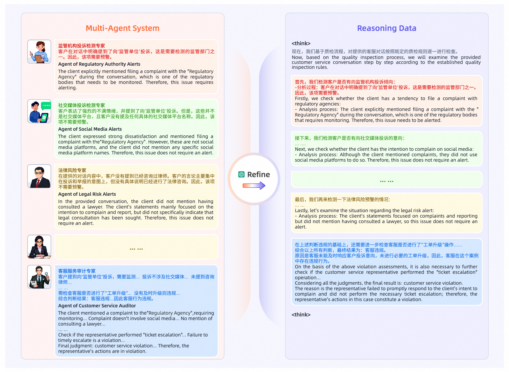
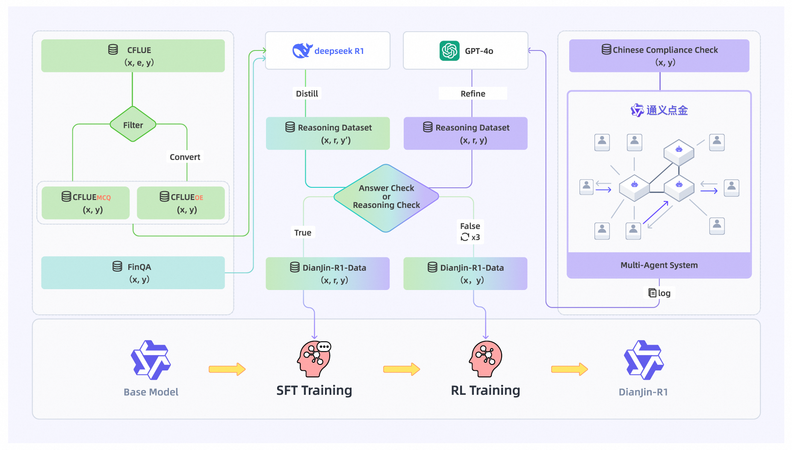

<div align="center">
    <h1><b>DianJin-R1</b></h1>
    <p>
    <b>面向金融领域的推理大模型</b>
    </p>

[](https://arxiv.org/abs/2504.15716)
[](https://github.com/aliyun/qwen-dianjin)
[](https://huggingface.co/DianJin)
[](https://modelscope.cn/organization/tongyi_dianjin)
[](https://huggingface.co/DianJin)
[](https://modelscope.cn/organization/tongyi_dianjin)

**中文** | [**EN**](README.md)

</div>

## 目录
- [简介](#summary)
- [数据集/模型下载](#download)
- [推理数据集](#dataset)
- [两阶段训练](#2step)
    - [阶段1: 通过SFT学习推理](#step1)
    - [阶段2: 利用RL增强推理](#step2)
- [模型评测](#eval)
    - [合并 & 部署](#merge_and_deploy)
    - [推理 & 评测](#infer_and_eval)
- [许可证](#license)
- [引用](#cite)

## 📢 简介<a name="summary"></a>

大型语言模型（LLMs）在金融领域的有效推理仍然是一个核心挑战，因为金融任务通常需要领域特定知识、精确的数值计算以及严格遵守合规规则。我们提出了DianJin-R1，一种增强推理的框架，通过推理增量的监督和强化学习来解决这些挑战。我们的方法的核心是DianJin-R1-Data，一个由CFLUE、FinQA和一个专有合规语料库（Chinese Compliance Check，CCC）构建的高质量数据集，结合了多样化的金融推理场景和经过验证的注释。我们的模型，DianJin-R1-7B和DianJin-R1-32B，从Qwen2.5-7B-Instruct和Qwen2.5-32B-Instruct微调而来，使用生成推理步骤和最终答案的结构化格式。为了进一步完善推理质量，我们应用组相对策略优化（GRPO），一种强化学习方法，结合了双重奖励信号：一个促进结构化输出，另一个奖励答案正确性。我们在五个基准测试中评估我们的模型：三个金融数据集（CFLUE、FinQA和CCC）和两个通用推理基准（MATH-500和GPQA-Diamond）。实验结果表明，DianJin-R1模型在复杂金融任务中始终优于其非推理模型。此外，在真实世界的CCC数据集上，我们的单次调用推理模型相比那些需要显著更多计算成本的多代理系统表现相当甚至更好。这些发现证明了DianJin-R1在通过结构化监督和奖励对齐学习加强金融推理方面的有效性，为现实世界应用提供了一个可扩展且实用的解决方案。

## 📥 数据集/模型下载<a name="download"></a>

|               |                       ModelScope                        |                 HuggingFace                 |
|:---------------:|:-------------------------------------------------------:|:-------------------------------------------:|
| DianJin-R1-Data | [数据](https://modelscope.cn/organization/tongyi_dianjin) |    [数据](https://huggingface.co/DianJin/)    |
|  DianJin-R1-7B  | [模型](https://modelscope.cn/organization/tongyi_dianjin) |    [模型](https://huggingface.co/DianJin/)    |
| DianJin-R1-32B  | [模型](https://modelscope.cn/organization/tongyi_dianjin) |    [模型](https://huggingface.co/DianJin/)    |


## 🔧 推理数据集<a name="dataset"></a>

<table>
<thead>
<tr>
<th>Dataset</th>
<th>Language</th>
<th>Size</th>
<th>Q_token</th>
<th>R_token</th>
<th>A_token</th>
</tr>
</thead>
<tbody>
<tr>
<td colspan="6" align="center">Used in SFT</td>
</tr>
<tr>
<td>CFLUE_{MCQ}</td>
<td>Chinese</td>
<td>26672</td>
<td>134.85</td>
<td>807.42</td>
<td>95.71</td>
</tr>
<tr>
<td>CFLUE_{OE}</td>
<td>Chinese</td>
<td>5045</td>
<td>49.28</td>
<td>857.04</td>
<td>485.60</td>
</tr>
<tr>
<td>FinQA</td>
<td>English</td>
<td>4581</td>
<td>1048.38</td>
<td>1576.91</td>
<td>148.42</td>
</tr>
<tr>
<td>CCC</td>
<td>Chinese</td>
<td>1800</td>
<td>1695.78</td>
<td>884.29</td>
<td>69.64</td>
</tr>
<tr>
<td colspan="6" align="center">Used in RL</td>
</tr>
<tr>
<td>CFLUE_{MCQ}</td>
<td>Chinese</td>
<td>4096</td>
<td>132.40</td>
<td>-</td>
<td>2.15</td>
</tr>
</tbody>
</table>

对于CFLUE数据集，我们首先使用gpt-4o把多项选择题转换为开放式问题，接着利用deepseek-r1获取推理数据。更多细节请参考[论文](https://arxiv.org/abs/2504.15716)。

对于FinQA数据集，其本身是开放式问题，我们无须进行额外转换。其余处理步骤同CFLUE保持一致。

对于CCC数据集，我们获取Multi-Agent System工作流中所有的推理步骤并使用gpt-4o合并为一个最终的推理过程和推理结果。



## 🔄 两阶段训练<a name="2step"></a>



### 阶段1: 通过SFT学习推理<a name="step1"></a>

#### 环境准备
我们使用[LLaMA-Factory](https://github.com/hiyouga/LLaMA-Factory)框架进行SFT训练，请安装如下依赖包
```shell
conda create -n llama python==3.10 -y
conda activate llama
git clone https://github.com/hiyouga/LLaMA-Factory.git
cd LLaMA-Factory
pip install -e .
pip install deepspeed==0.15.4
pip install vllm==0.8.2
```

#### 训练（以Qwen2.5-7B-Instruct为例）
```shell
cd src/sft
bash sft.sh
```

### 阶段2: 利用RL增强推理<a name="step2"></a>
#### 环境准备
我们使用[verl](https://github.com/volcengine/verl)框架进行GRPO训练，请安装如下依赖包
```shell
conda create -n verl python==3.10 -y
conda activate verl
git clone https://github.com/volcengine/verl.git
cd verl
pip install -e .
pip install flash-attn --no-build-isolation
pip install vllm==0.8.2
```

#### 奖励函数

格式正确+答案正确得分为1，其余情况得分为0，详情参考`rl/reward_score_cflue.py`

#### 训练（以Qwen2.5-7B-Instruct为例）

```shell
cd src/rl
bash grpo.sh
```

## 📊 模型评测<a name="eval"></a>

<table>
<thead>
<tr>
<th rowspan="2">Model</th>
<th colspan="3" align="center">Financial</th>
<th colspan="2" align="center">General</th>
<th rowspan="2">Avg.</th>
</tr>
<tr>
<th>CFLUE</th>
<th>FinQA</th>
<th>CCC</th>
<th>MATH</th>
<th>GPQA</th>
</tr>
</thead>
<tbody>
<tr>
<td colspan="7" align="center">General models without explicit reasoning</td>
</tr>
<tr>
<td>GPT-4o</td>
<td>71.68</td>
<td>79.16</td>
<td>50.00</td>
<td>77.93</td>
<td>39.56</td>
<td>63.67</td>
</tr>
<tr>
<td>DeepSeek-V3</td>
<td>75.14</td>
<td><b>81.34</b></td>
<td>57.50</td>
<td>87.20</td>
<td>45.45</td>
<td>68.33</td>
</tr>
<tr>
<td>Qwen2.5-7B-Instruct</td>
<td>69.37</td>
<td>66.70</td>
<td>55.00</td>
<td>71.40</td>
<td>33.84</td>
<td>59.26</td>
</tr>
<tr>
<td>Qwen2.5-32B-Instruct</td>
<td>77.95</td>
<td>79.51</td>
<td>56.50</td>
<td>81.00</td>
<td>44.95</td>
<td>67.98</td>
</tr>
<tr>
<td>Qwen2.5-72B-Instruct</td>
<td>79.46</td>
<td>77.94</td>
<td>55.50</td>
<td>82.20</td>
<td>39.90</td>
<td>67.00</td>
</tr>
<tr>
<td colspan="7" align="center">General models with reasoning </td>
</tr>
<tr>
<td>DeepSeek-R1</td>
<td><ins>86.64</ins></td>
<td>79.81</td>
<td>67.50</td>
<td><ins>94.80</ins></td>
<td><b>66.16</b></td>
<td><ins>78.98</ins></td>
</tr>
<tr>
<td>DeepSeek-R1-Distill-Qwen-7B</td>
<td>48.39</td>
<td>66.09</td>
<td>41.50</td>
<td>90.20</td>
<td>45.96</td>
<td>58.43</td>
</tr>
<tr>
<td>DeepSeek-R1-Distill-Qwen-14B</td>
<td>70.83</td>
<td>76.63</td>
<td>50.00</td>
<td>93.20</td>
<td>54.55</td>
<td>69.04</td>
</tr>
<tr>
<td>DeepSeek-R1-Distill-Qwen-32B</td>
<td>78.52</td>
<td>77.00</td>
<td>52.00</td>
<td><b>95.00</b></td>
<td><ins>63.64</ins></td>
<td>73.23</td>
</tr>
<tr>
<td>QwQ-32B</td>
<td>83.49</td>
<td>78.38</td>
<td>52.00</td>
<td><b>95.00</b></td>
<td><ins>63.64</ins></td>
<td>74.50</td>
</tr>
<tr>
<td colspan="7" align="center">DianJin-R1 with reasoning</td>
</tr>
<tr>
<td>DianJin-R1-7B</td>
<td>80.32</td>
<td>77.72</td>
<td><ins>94.50</ins></td>
<td>76.60</td>
<td>37.54</td>
<td>73.34</td>
</tr>
<tr>
<td>DianJin-R1-32B</td>
<td><b>86.74</b></td>
<td><ins>80.82</ins></td>
<td><b>96.00</b></td>
<td>88.20</td>
<td>58.59</td>
<td><b>82.07</b></td>
</tr>
</tbody>
</table>


#### 合并 & 部署<a name="merge_and_deploy"></a>

我们需要把fsdp训练后的模型合并成huggingface格式，并使用VLLM进行部署以进行快速推理。

```shell
cd src/evaluate
# 合并模型
python3 merge_model.py --fsdp_path <ckpt path after GRPO> --hf_path <base model path> --out_path checkpoints/Qwen2.5-7B-Instruct-GRPO
# 部署模型
bash run_vllm.sh
```

#### 推理 & 评测<a name="infer_and_eval"></a>

- CFLUE & FinQA

相关代码存放于`src/evaluate/eval.py`，其中`eval_cflue`和`eval_finqa`分别用于CFLUE、FinQA数据集的评测。

```shell
# 评测示例
cd src/evaluate
python3 eval.py --result_path <result path>
```

- MATH & GPQA

请参考[EvalScope](https://github.com/modelscope/evalscope)进行MATH和GPQA-Diamond的评测。

## 📋 许可证<a name="license"></a>

本项目遵循 [MIT License](https://lbesson.mit-license.org/).

## 🔖 引用<a name="cite"></a>

如果您使用了我们的数据集或模型，请引用我们的论文。

```
@article{dianjin-r1,
    title   = {DianJin-R1: Evaluating and Enhancing Financial Reasoning in Large Language Models}, 
    author   = {Jie Zhu, Qian Chen, Huaixia Dou, Junhui Li, Lifan Guo, Feng Chen, Chi Zhang},
    journal = {arxiv.org/abs/2504.15716},
    year    = {2025}
}
```